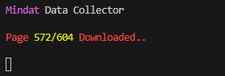
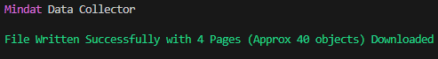

# Mindat Data Collector
 
This is a simple little NodeJS tool I threw together to show how to use the Mindat API to repeatedly grab pages of info from mindat to copy an entire database locally.

For this one I used the page 'https://api.mindat.org/geomaterials/'

Visit the page while logged in to view more information / get filters / view the database.

You can change the filters and functionality in the index.js file.

## How to use

Simply make a blank plaintext file called `.env` (A file for storing credentials)

Inside the .env file, simply add one line at the top with your API key (Can be found in your user page. Click "Edit User Page" and youll find it at the bottom.

```dotenv
KEY=PutYourMindatAPIKeyHere
```

This repository is configured to automatically exclude .envs, so dont worry about accidentally uploading it to github if you fork it.

Thats it! Run the index.js (`node index.js`) and it will automatically run each page one by one, outputting the progress to the console, and will output the finalized information into a json file.

Some examples of a successful console output:





You can change what information it pulls and what page it pulls from within the main request.get callback.

### DO NOT SPAM MINDAT. Im not responsible for any ratelimits or API bans you may acquire. This caller grabs each page one at a time and waits on each successful pull. This avoids heavy call counts to their API.
